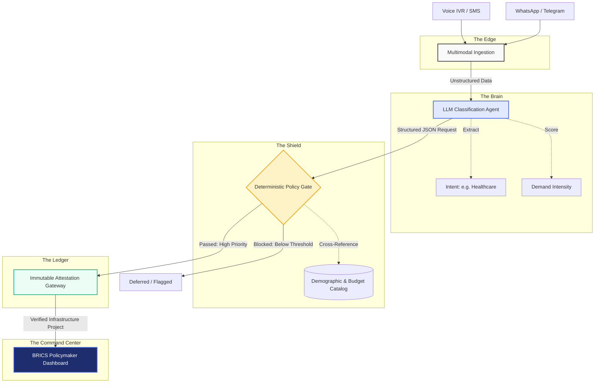

# Aegis-DPI: Citizen-Centric Infrastructure Prioritization Platform

**Hackathon Submission:** Track 1 — AI for Digital Public Infrastructure & Governance
**BRICS Theme:** Innovation

## 🌍 The Problem
Governments often struggle to consolidate citizen feedback and align it with national infrastructure priorities. Development requests live in fragmented systems, leading to misaligned public spending, unaddressed infrastructure gaps, and no way to measure the impact of large-scale digital public infrastructure initiatives.

## 💡 The Challenge & Our Solution
**The Challenge:** Build a scalable, multilingual AI platform — designed as a Digital Public Good — that aggregates citizen development requests via voice, text, and messaging apps across diverse linguistic regions. The system should analyse large datasets combining citizen feedback with national demographic data, infrastructure indices, and public investment plans, surfacing demand hotspots and recommending high-priority development projects to national policymakers across BRICS nations.

**Our Solution (Aegis-DPI):** 
Aegis-DPI meets this challenge head-on. By analyzing unstructured feedback alongside demographic data, infrastructure indices, and public investment plans, Aegis-DPI surfaces **demand hotspots** and recommends **high-priority projects** to BRICS policymakers.

---

## 🏗️ Architecture & Flow

Aegis-DPI employs a robust, hybrid architecture that pairs the reasoning capabilities of LLMs with a strict, deterministic policy engine to ensure safety and alignment with government budgets.



1. **Multimodal Ingestion (The Edge)**
   - Citizens submit requests via low-bandwidth channels (SMS, USSD) or rich channels (WhatsApp bots, Voice IVR).
   - *Example:* "हमारे गाँव में अस्पताल की बहुत ज़रूरत है।" (Hindi: Our village urgently needs a hospital.)
2. **AI Classification (The Brain)**
   - Powered by `buyer_agent.py`, the AI processes the unstructured input, translates it, and extracts the core infrastructure intent (e.g., Healthcare, Transport, Education) and demand intensity.
3. **Deterministic Policy Gate (The Shield)**
   - The `bounding_gate.py` intercepts the AI's classification. It cross-references the request against the `catalog_engine.py` (representing the national infrastructure budget and priority thresholds).
   - **Crucial:** The LLM *never* makes the final allocation decision. The Bounding Gate enforces strict priority thresholds to prevent hallucinated budgets or adversarial prioritization.
4. **Prioritization & Attestation (The Ledger)**
   - Valid, high-priority demands that pass the policy gate are queued for BRICS review.
   - We utilize a repurposed gateway (`payment_gateway.py`) as a secure, immutable attestation layer to cryptographically verify prioritized projects.
5. **Dashboard & Insights (The Command Center)**
   - The frontend (`index.html`) provides policymakers with a real-time heatmap of geographic demand, demographic data overlays (HDI, Investment Gaps), and a live multilingual feedback feed.

---

## 🚀 Quick Setup & Deployment

### 1. Prerequisites
- Python 3.10+
- A Groq API Key (for the LLM analysis)
- (Optional) Razorpay Test Keys for the verification attestation layer

### 2. Environment Variables
Create a `.env` file in the root directory:
```env
GROQ_API_KEY=your_groq_api_key
GROQ_MODEL=llama3-70b-8192

# Optional: For the Attestation/Verification Layer
RAZORPAY_KEY_ID=your_test_key
RAZORPAY_KEY_SECRET=your_test_secret
```

### 3. Installation
Install the required dependencies:
```bash
pip install -r requirements.txt
```

### 4. Running the Platform
Start the FastAPI server:
```bash
uvicorn app.main:app --host 0.0.0.0 --port 8000 --reload
```
The Command Center dashboard will be available at: `http://localhost:8000/`

---

## 🌐 Deploy for Free (With Zero Delay/Cold Starts)

For a hackathon, you want a live link that loads instantly for judges. We have configured a `render.yaml` file so you can deploy this completely for free, and use a simple ping mechanism to prevent it from ever sleeping.

### Step 1: Deploy on Render (Free)
1. Push this repository to your GitHub.
2. Go to [Render.com](https://render.com/) and sign in with GitHub.
3. Click **New +** -> **Blueprint**.
4. Connect your GitHub repository. Render will automatically read the `render.yaml` file and deploy the Web Service.
5. In the Render Dashboard, go to your new Web Service -> **Environment**, and add your `GROQ_API_KEY`.

### Step 2: Prevent Cold Starts (Zero Delay)
Render's free tier spins down your app after 15 minutes of inactivity, causing a 30-second delay for the next visitor. 
1. Copy your live Render URL (e.g., `https://aegis-dpi.onrender.com`).
2. Go to [UptimeRobot.com](https://uptimerobot.com/) (Free).
3. Create a **New Monitor** (Type: HTTP(s)).
4. Paste your URL and append the health endpoint: `https://aegis-dpi.onrender.com/health`.
5. Set the monitoring interval to **5 minutes**.

*Result: UptimeRobot pings your `/health` endpoint every 5 minutes, keeping the server permanently awake. When the judges click your link, it will load instantly.*

---

## 🛡️ Built for BRICS Governance
Aegis-DPI is designed with the unique needs of BRICS nations in mind:
* **Multilingual by Default:** Supports Hindi, Mandarin, Portuguese, Russian, Zulu, and more.
* **Low-Bandwidth Resilient:** Capable of processing SMS and IVR inputs for deep rural penetration.
* **Strictly Governed AI:** The architecture ensures that AI acts as a sensor, not a sovereign. All policy decisions are deterministic and traceable.
